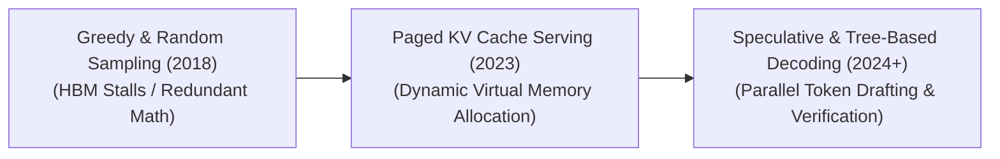

# Awesome-Auto-Regressive-Decoding
## Autoregressive Decoding in AI: Evolution, Variants, Types, & Applications

Autoregressive Decoding is the fundamental text-generation paradigm utilized by modern generative Large Language Models (LLMs) and multi-modal transformers. In an autoregressive system, text generation is handled sequentially, token-by-token. The model treats its own historical outputs as the absolute prompt context for its subsequent steps, computing a forward pass to output a single token at index $t$ by evaluating all prior tokens at indices $< t$. Because each step relies on loading the entire multi-billion parameter model from memory, autoregressive decoding is highly memory-bandwidth bound, driving a rich ecosystem of hardware optimizations, caching layers, and predictive decoding strategies to scale generation throughput.

---

## 1. The Chronological Evolution

The implementation of autoregressive sequence generation has transitioned from basic greedy calculations to memory-pinned cache pools and parallelized, predictive drafting pipelines.

*   **The Baseline Sampling Era (Pre-2023)**
    *   *Concept:* The entry-level standard. Text generation calculated tokens sequentially using basic heuristic search methods (Greedy, Top-k, Top-p). 
    *   *Limitation:* Catastrophically inefficient on hardware. At every single token step, the GPU was forced to re-read and re-compute the Key-Value (KV) attention vectors for all preceding tokens in the prompt history, resulting in severe compute waste and heavy High Bandwidth Memory (HBM) latency.
*   **The Virtual Memory Allocation Era (PagedAttention / vLLM, ~2023–2024)**
    *   *Concept:* Resolved the memory fragmentation crisis. Inspired by classical operating system paging, **PagedAttention** partitioned the Key-Value cache of historical tokens into fixed-size virtual blocks, storing them non-contiguously in VRAM.
    *   *Significance:* Fully eliminated VRAM fragmentation bottlenecks. This compressed the memory footprint of autoregressive decoding by up to $96\%$, allowing cloud enterprise servers to run massive concurrent multi-user generations.
*   **The Speculative & Lookahead Era (~2024–Present)**
    *   *Concept:* The modern state-of-the-art inference baseline. Bypasses the strict "one forward pass per single token" limit. Systems deploy **Speculative Decoding** (pairing a giant target model with a hyper-fast draft model or parallel Medusa heads) or **Prompt Lookup Decoding**, drafting multiple candidate tokens ahead in parallel and verifying them in a single, rapid GPU matrix operation.

---

## 2. Core Functional Search & Sampling Variants

Once the autoregressive layer outputs an unnormalized log-odds vector (logits), distinct decoding sampling parameters dictate how a token ID is selected.

*   **Greedy Search Decoding**
    *   *Mechanism:* A rigid, deterministic selection method. At every step, the system skips statistical sampling and directly extracts the single token possessing the absolute highest logit probability.
    *   *Application:* Perfect for closed-box, non-creative logic tasks requiring absolute consistency, such as writing software code, executing math calculations, or parsing database tables.
*   **Top-k & Top-p (Nucleus) Sampling**
    *   *Mechanism:* Truncates long-tail noise. **Top-k** restricts choices strictly to the $K$ highest-scoring tokens. **Top-p** dynamically scales the token selection pool, filtering out long-tail tokens and keeping only the smallest set whose cumulative probability crosses a target threshold $p$ (typically $p=0.90$).
*   **Min-P Sampling**
    *   *Mechanism:* An advanced, content-dependent filtering modification. It calculates the probability of the absolute top token first and drops any alternative token whose score falls below a minimum scaled fraction of that primary peak (e.g., discarding options scoring $< 5\%$ of the top token).
    *   *Pros:* Automatically drops irrelevant tokens during highly certain prompt tracks, while preserving diverse alternative paths during complex logical forks.

---

## 3. Structural Sequence Verification & Acceleration Types

To overcome the heavy execution bottlenecks of autoregressive loops, engineering pipelines leverage specialized runtime hardware acceleration layers.

*   **Speculative Decoding (Draft-and-Verify)**
    *   *Mechanism:* A tiny, low-parameter draft model runs $K$ rapid sequential lookahead tokens. The massive target model then ingests the entire candidate block simultaneously, verifying the text sequence using parallel matrix calculations to step past the memory bandwidth wall.
*   **FlashAttention Kernel Fusion**
    *   *Mechanism:* Fuses the attention and masking loops of autoregressive decoding directly into the GPU's fast, on-chip SRAM registers via tiling algorithms.
    *   *Pros:* Drops memory consumption curves from quadratic ($O(N^2)$) down to true linear scaling ($O(N)$), preventing hardware stalls during long-context processing.
*   **Medusa / Multi-Head Self-Speculation**
    *   *Mechanism:* Eliminates secondary draft models entirely by appending multiple parallel, independent linear prediction heads directly onto the terminal layer of the primary model graph, drafting multiple future token offsets concurrently.

---

## 4. Production Engineering Challenges & Mitigations

Deploying autoregressive pipelines across enterprise-scale cloud infrastructures introduces intense memory bottlenecks and time-to-first-token latency spikes.

*   **The Key-Value (KV) Cache Memory Wall**
    *   *The Problem:* As the model continues writing text over long context windows, the memory required to store the attention vectors (Keys and Values) for all historical tokens expands linearly ($O(N)$), quickly accumulating to gigabytes per user session and triggering Out-of-Memory system crashes.
    *   *Mitigation:* Implementing **Grouped-Query Attention (GQA)** to compress the number of Key-Value heads, coupled with **StreamingLLM attention sinks** that permanently cache the first 4 tokens while rolling out a sliding window over intermediate tokens.
*   **The Time-to-First-Token (TTFT) Latency Spike**
    *   *The Problem:* Before the autoregressive token-by-token loop can initiate, the GPU must process the user's initial prompt input all at once (the pre-fill phase). If a user provides a massive 100,000-word context, the pre-fill step creates a long processing delay before the first word is printed.
    *   *Mitigation:* Implementing **Chunked Prefills**, dividing massive incoming context strings into small, manageable chunks that interleave smoothly with active generation tokens across execution batches.

---

## 5. Frontier Real-World AI Serving Applications

*   **High-Throughput Enterprise Chat Infrastructures (vLLM / TensorRT-LLM)**
    *   *Application:* Serves as the high-volume orchestration engine powering commercial AI chat assistants. Paged virtual memory managers and fused compilation kernels maximize hardware concurrency, serving thousands of concurrent users per node stably.
*   **Real-Time Autonomous Software Coding Assistants (Copilot / Cascade)**
    *   *Application:* Drives real-time source code autocomplete lines inside IDE text editors. Because programming syntaxes feature high repetition and rigid keyword structures (`def`, `import`, `return`), lookahead and speculative decoding engines achieve near-perfect token draft acceptance rates, rendering large code blocks instantly.
*   **On-Device Edge Model Inference (Llama.cpp / GGUF Local Layouts)**
    *   *Application:* Runs localized reasoning models on consumer-grade hardware 
