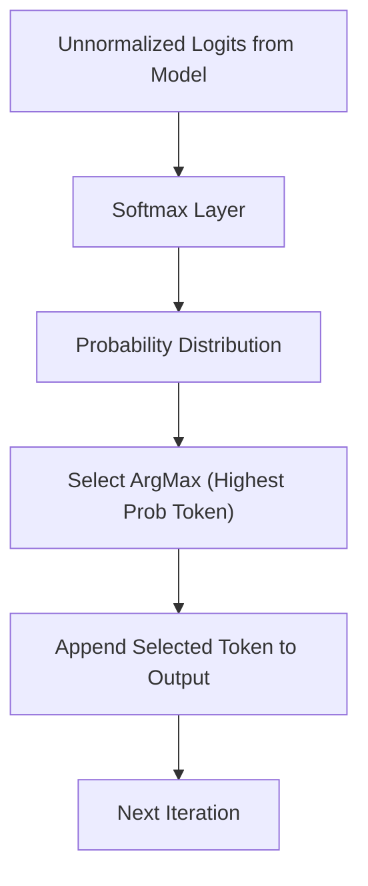

# Greedy Search Decoding

## Explanation
**Greedy Search Decoding** is the simplest and most straightforward algorithm used to extract tokens from a model's predicted probability distribution during autoregressive decoding.

### Mechanism
At each generation step $t$, the model outputs raw logits for the entire vocabulary. These logits are converted into a probability distribution via Softmax. Greedy search simply selects the token index with the highest probability:
$$T_t = \arg\max_{w \in V} P(w \mid T_{<t})$$
This process is repeated deterministically until an End-of-Sequence (EOS) token is produced or the maximum generation length is reached.

### Significance
Greedy search acts as the primary benchmark for all sampling methods and is widely used for tasks requiring high predictability and correctness rather than diversity.

### Advantages
* **Deterministic**: Running the same prompt with the same weights will always yield the exact same output.
* **No Hyperparameters**: Does not require tuning parameters like temperature, top-k, or top-p.
* **Computational Simplicity**: Avoids the sorting or sampling overhead associated with probabilistic methods.

### Limitations
* **Repetitive Loops**: Susceptible to getting stuck in local loop structures (repeating sentences or phrases indefinitely).
* **Lacks Creativity**: Cannot produce diverse or highly creative text variations.
* **Sub-optimal Paths**: Since it only looks one step ahead, it can miss globally optimal sequences (unlike Beam Search).

---

## Architecture Diagram

---

[Back to README](../README.md)
