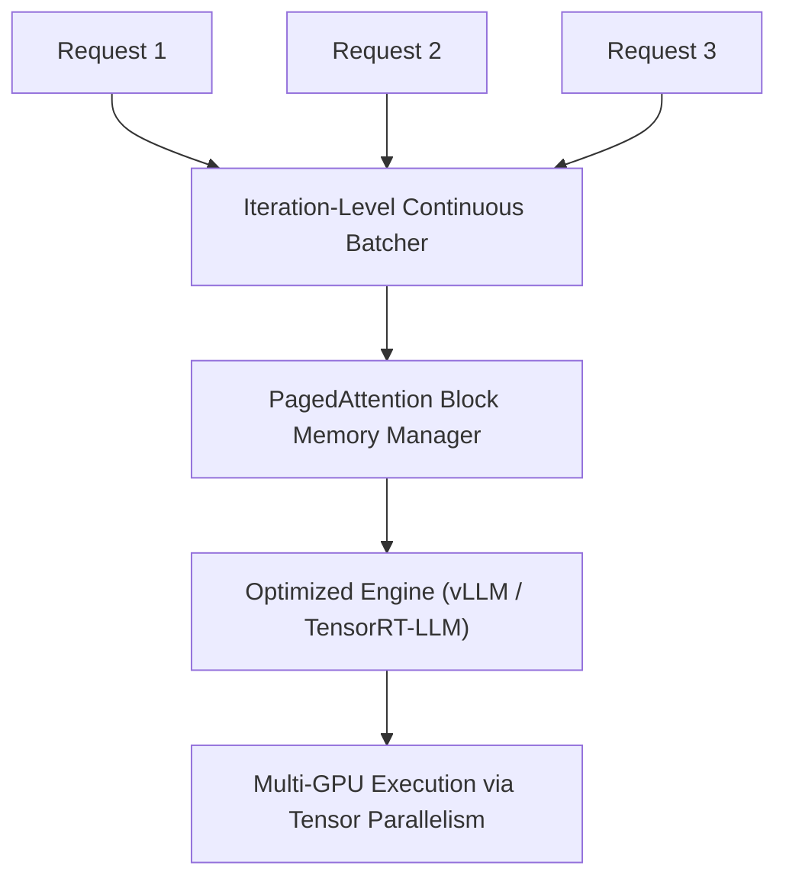

# High-Throughput Enterprise Chat Infrastructures (vLLM / TensorRT-LLM)

## Explanation
**High-Throughput Enterprise Chat Infrastructures** represent the software systems and compilers engineered to serve LLMs cost-effectively at massive scale.

### Mechanism
These serving frameworks combine several modern runtime optimizations:
1. **Dynamic Paged KV Caching**: Minimizes VRAM allocation waste.
2. **Continuous Batching (Iteration-level Scheduling)**: Groups new pre-fill tasks and active decoding steps dynamically within the same batch, avoiding GPU idle time.
3. **Graph Compilation & Optimization**: Tools like TensorRT-LLM or vLLM compile PyTorch models into highly optimized CUDA graph structures, fusing kernels and reducing CPU launch overheads.
4. **Tensor Parallelism (TP)**: Splits weights across multiple GPUs (within a node) via communication libraries like NCCL.

### Significance
It enables cloud providers to handle thousands of concurrent API requests per node, significantly lowering the cost per million tokens.

### Advantages
* **High Efficiency**: Increases GPU utilization and throughput by up to 10x compared to native PyTorch pipelines.
* **Low Latency**: Keeps response times stable even under heavy, concurrent user traffic.
* **Flexible Deployments**: Supports dynamic changes in parameters (e.g., different temperatures, top-p values) across queries in the same batch.

### Limitations
* **Cold Starts**: Initial compilation can take hours for new model weights (especially with TensorRT-LLM).
* **Hardware Requirements**: Demands enterprise-grade GPUs (e.g., A100, H100) with fast NVLink connections for multi-GPU performance.

---

## Architecture Diagram

---

[Back to README](../README.md)
