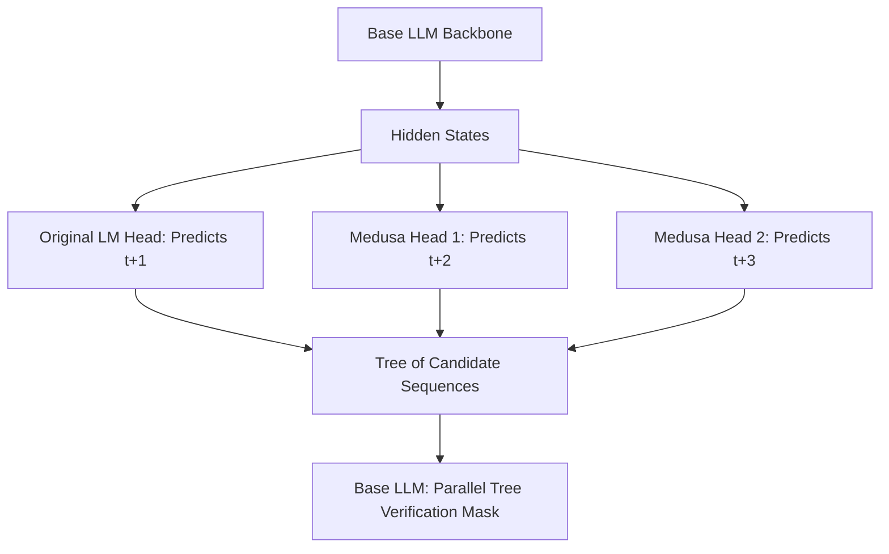

# Medusa / Multi-Head Self-Speculation

## Explanation
**Medusa** is an alternative speculative decoding architecture that achieves acceleration without requiring a secondary, standalone draft model.

### Mechanism
Rather than pairing a target model with a smaller draft model, Medusa integrates draft heads directly into the main model:
1. **Parallel Prediction Heads**: Appends multiple linear projection heads (Medusa heads) to the top of the terminal transformer layer of the base model.
2. **Multi-Step Drafting**: Head 1 predicts the next token ($t+1$), Head 2 predicts $t+2$, Head $K$ predicts $t+K$ in parallel during a single forward pass.
3. **Tree-Based Verification**: The generated candidates are organized into a tree structure. In the next forward pass, the base model evaluates all tree paths simultaneously using a specialized 2D attention mask.
4. **Verification**: Valid paths are accepted, accelerating generation without external model overhead.

### Significance
Medusa simplifies speculative decoding system logistics, eliminating the need to coordinate and fit two separate models into GPU VRAM.

### Advantages
* **Single Model Deployment**: Easier serving configuration since there is no separate draft model to manage.
* **Higher Speedups**: Often outperforms standard draft-model speculative decoding because the heads share representations directly with the base model.
* **No Synchronization Delays**: Eliminates latency associated with passing states between two separate neural networks.

### Limitations
* **Training Overhead**: Requires parameter-efficient fine-tuning (PEFT) or training to align the Medusa heads with the base model weights.
* **VRAM Overhead**: Slightly increases base model parameters (usually by 1-5% due to the linear heads).

---

## Architecture Diagram

---

[Back to README](../README.md)
