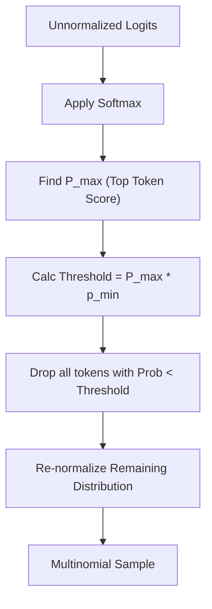

# Min-P Sampling

## Explanation
**Min-P Sampling** is an advanced, content-dependent decoding filter designed as a superior alternative to Top-p (Nucleus) and Top-k sampling.

### Mechanism
Unlike Top-p, which accumulates probabilities starting from the top down to a fixed percentage, Min-P evaluates candidates relative to the absolute probability of the single top-ranked token ($P_{max}$):
1. Identify the highest probability token score: $P_{max}$.
2. Calculate the minimum threshold dynamically:
   $$\text{Threshold} = P_{max} \times p_{min}$$
   (where $p_{min}$ is a hyperparameter, usually between $0.05$ and $0.15$).
3. Keep only the tokens whose individual probability is greater than or equal to this threshold.
4. Re-normalize and sample from the filtered list.

### Significance
Min-P scales the filtering criteria based on model confidence. When the top token has extremely high probability (e.g., $0.98$), the threshold is high, blocking distracting noise. When the top token has low confidence (e.g., $0.10$), the threshold drops, opening up a wider range of creative alternatives.

### Advantages
* **Highly Adaptive**: Seamlessly transitions between rigid logical generation and creative exploration.
* **Reduces Hallucinations**: Successfully filters out low-probability nonsense tokens that sometimes slip through Top-p filters in confident contexts.

### Limitations
* **New Parameter Tuning**: Requires developers to adjust and learn a new hyperparameter space ($p_{min}$) compared to the well-known Top-p defaults.

---

## Architecture Diagram

---

[Back to README](../README.md)
