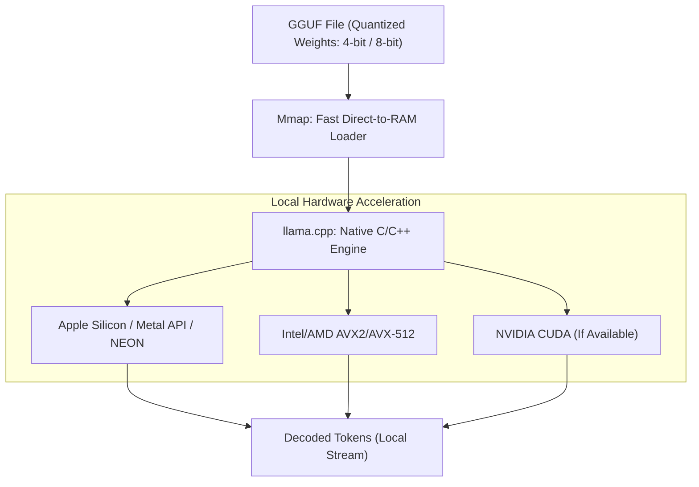

# On-Device Edge Model Inference (Llama.cpp / GGUF Local Layouts)

## Explanation
**On-Device Edge Model Inference** refers to running LLMs directly on local user hardware—such as laptops, phones, or edge devices—rather than relying on cloud APIs.

### Mechanism
This local execution ecosystem is powered by key technological components:
1. **llama.cpp**: A highly optimized C/C++ implementation of transformer architectures, avoiding heavy Python dependencies.
2. **GGUF (GPT-Generated Unified Format)**: A single-file binary format designed for storing models. It supports fast loading, memory mapping (mmap), and houses both model metadata and tensor weights.
3. **Advanced Quantization**: Compresses 16-bit floating-point weights down to 2-bit, 4-bit, or 8-bit integers (e.g., Q4_K_M) using integer multiplication kernels.
4. **Unified Memory Architectures**: Leverages platforms like Apple Silicon (M-series chips) where CPU and GPU share high-speed unified RAM, allowing large models to fit and run efficiently.

### Significance
It enables private, offline, and cost-free LLM usage, bypassing data privacy concerns and cloud subscription fees.

### Advantages
* **Offline Execution**: Works without internet access.
* **Cost Efficiency**: Zero operational server costs for the developer.
* **Low Latency**: Eliminates network transmission latency.
* **Privacy**: Sensitive data never leaves the local machine.

### Limitations
* **Compute Constraints**: Limited by the user's local hardware (e.g., lower token-per-second generation speeds compared to multi-GPU cloud nodes).
* **Quantization Loss**: Aggressive compression (e.g., 2-bit) can cause visible drops in reasoning quality.

---

## Architecture Diagram

---

[Back to README](../README.md)
