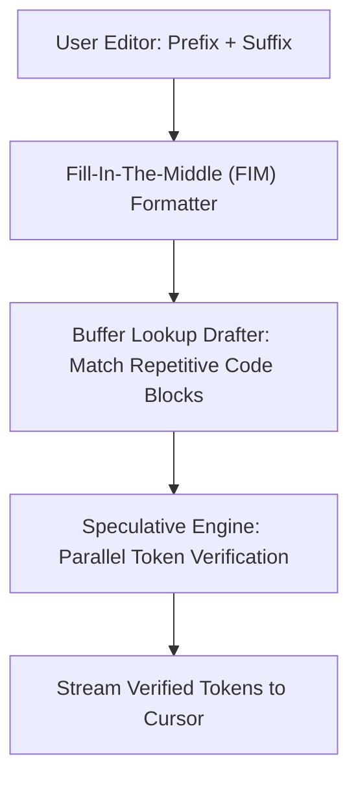

# Real-Time Autonomous Software Coding Assistants (Copilot / Cascade)

## Explanation
**Real-Time Autonomous Software Coding Assistants** are specialized generative AI systems integrated into IDEs (like VS Code or cursor editors) to provide instant code suggestions and completions.

### Mechanism
These assistants use customized decoding pipelines tailored to code structure:
1. **Fill-in-the-Middle (FIM)**: Autoregressively generates code by conditioning on both the prefix (code before the cursor) and the suffix (code after the cursor).
2. **Lookahead / Prompt Lookup Decoding**: Exploits the high repetition in programming languages (e.g., recurring keywords like `public static void`, `import`, `return`). The engine drafts several candidate tokens from the open editor buffer and verifies them in parallel.
3. **Low-Latency Streaming**: Returns tokens to the IDE editor with minimal latency to avoid disrupting the developer's typing flow.

### Significance
It transformed software engineering by automating boilerplate code, APIs, and tests directly in the editor.

### Advantages
* **High Draft Acceptance Rates**: Code's highly structured syntax leads to high acceptance rates (often >70%) when using speculative or lookup-based decoding.
* **Low Context Overhead**: Frequently uses prompt-caching systems to store active project files, keeping TTFT low when navigating projects.

### Limitations
* **Hallucinatory APIs**: The model may generate invalid library calls or syntax errors.
* **Context Windows**: Large codebases can quickly exceed context limits or slow down generation if context loading is unoptimized.

---

## Architecture Diagram

---

[Back to README](../README.md)
