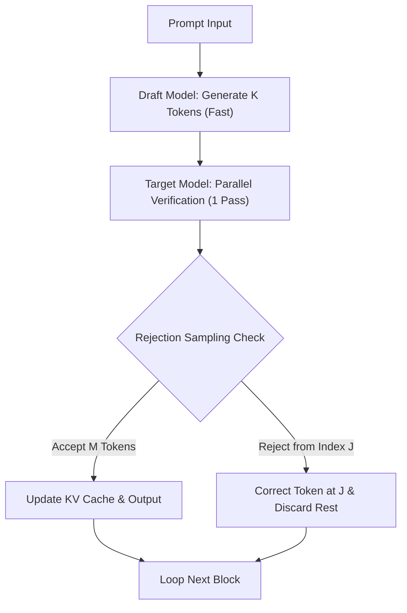

# Speculative Decoding (Draft-and-Verify)

## Explanation
**Speculative Decoding** is a dual-model execution strategy that accelerates LLM inference by bypassing the memory-bandwidth bottleneck of large autoregressive models.

### Mechanism
The architecture pairs two models: a small, fast **Draft Model** (approx. 1B-3B parameters) and a large **Target Model** (approx. 70B+ parameters).
1. **Draft Step**: The draft model runs $K$ sequential autoregressive steps, creating a candidate token sequence very quickly.
2. **Verify Step**: The target model runs a single forward pass over the draft sequence. It computes the attention queries for all $K$ candidates in parallel.
3. **Compare**: Using a rejection sampling algorithm, the target model compares its generated probabilities against the draft probabilities.
4. **Step Forward**: The target model accepts $M \le K$ tokens. The first mismatched token is corrected, and the generation skips forward by $M+1$ tokens.

### Significance
It allows high-end target models to produce outputs at the speed of a smaller draft model when the draft predictions match the target's preferences.

### Advantages
* **Strictly Lossless**: The generated text is guaranteed to match the probability distribution of the target model exactly.
* **Saves Latency**: Substantially increases decoding speed (up to 2x-3x speedup) on GPUs.

### Limitations
* **Model Alignment**: Requires the draft and target models to share the exact same tokenizer.
* **Draft Accuracy Dependency**: If the draft model is poorly aligned with the target model, the acceptance rate drops, reducing speed gains.

---

## Architecture Diagram

---

[Back to README](../README.md)
