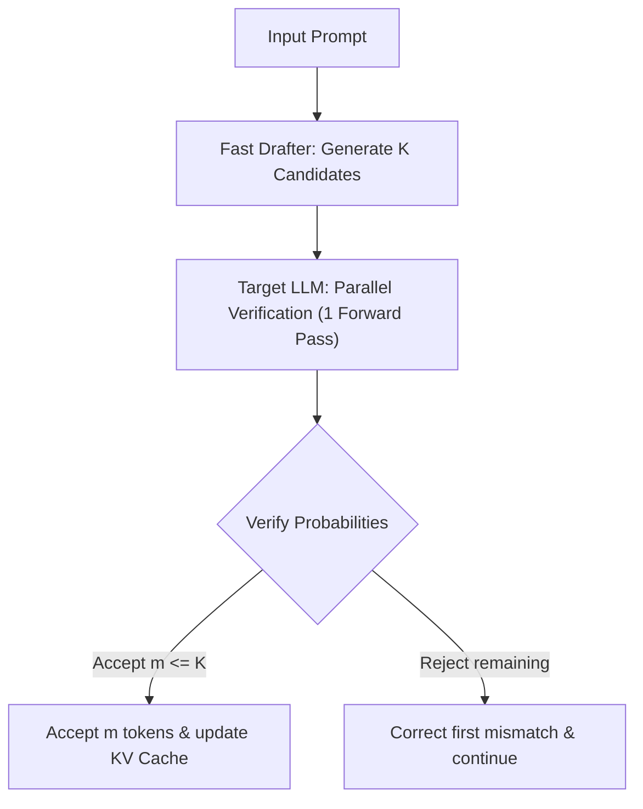

# The Speculative & Lookahead Era (~2024–Present)

## Explanation
The **Speculative & Lookahead Era** represents the modern state of the art in LLM inference. It breaks the traditional constraint of executing one expensive GPU forward pass to generate a single token.

### Mechanism
Rather than invoking a large target LLM for every single token, systems in this era run parallel token drafting:
1. **Drafting Phase**: A cheaper mechanism (such as a tiny helper model, draft heads, or prompt search) proposes $K$ candidate tokens.
2. **Verification Phase**: The massive target LLM processes all $K$ tokens in a single forward pass using a tree or sequence attention mask.
3. **Acceptance Phase**: The target LLM evaluates the candidates against its own probability distribution. Valid tokens are accepted, and generation skips forward by multiple tokens at once.

### Significance
It shifts LLM inference from being purely memory-bandwidth bound to being partially compute-bound, maximizing the performance of modern GPU tensor cores.

### Advantages
* **Massive Wall-Clock Speedups**: Typically yields a 1.5x to 3x decrease in latency without modifying the target model's output quality.
* **Lossless Output**: The target model's output probability distribution is mathematically preserved (unlike quantization or pruning).

### Limitations
* **Drafting Overhead**: If the draft acceptance rate is low (e.g., in highly creative tasks), the drafting phase wastes time and can slightly slow down baseline speed.
* **System Integration**: Significantly increases serving pipeline complexity, requiring coordinated scheduling of draft and target models.

---

## Architecture Diagram

---

[Back to README](../README.md)
