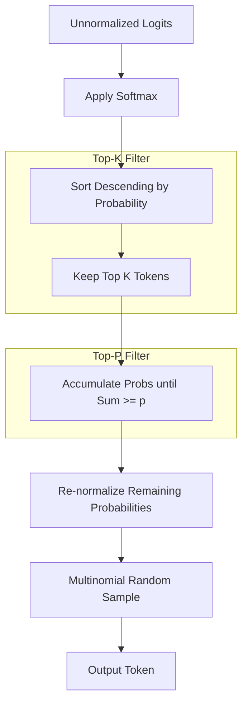

# Top-k & Top-p (Nucleus) Sampling

## Explanation
**Top-k** and **Top-p (Nucleus) Sampling** are heuristic filtering techniques designed to introduce controlled randomness and diversity into autoregressive decoding while preventing nonsense outputs.

### Mechanism
These algorithms filter the output vocabulary before sampling:
1. **Top-k**: Keeps only the $k$ tokens with the highest probabilities. The rest are zeroed out, and the remaining distribution is re-normalized.
2. **Top-p (Nucleus)**: Keeps the smallest subset of tokens whose cumulative probability exceeds a threshold $p$ (e.g., $0.90$). The size of the selection pool dynamically expands or contracts depending on the shape of the probability distribution.

```
Logits -> Softmax -> Sort Descending -> Filter (Top-k and/or Top-p) -> Sample
```

### Significance
These methods solved the common generation failures of the early LLM era (repetitiveness of greedy search and gibberish outputs from pure random sampling).

### Advantages
* **Natural Flow**: Introduces variety in creative writing, brainstorming, and conversation.
* **Dynamic Pool (Top-p)**: Adapts to context; when the model is highly confident, the pool size is small, and when it is uncertain, the pool expands.

### Limitations
* **Static Thresholds**: Choosing static parameters (e.g., $k=50, p=0.9$) may not perform optimally across different prompt styles.
* **Long-Tail Truncation**: Can still occasionally cut off valid low-probability terms or include gibberish tokens when the top token dominates the distribution.

---

## Architecture Diagram


---

[Back to README](../README.md)
