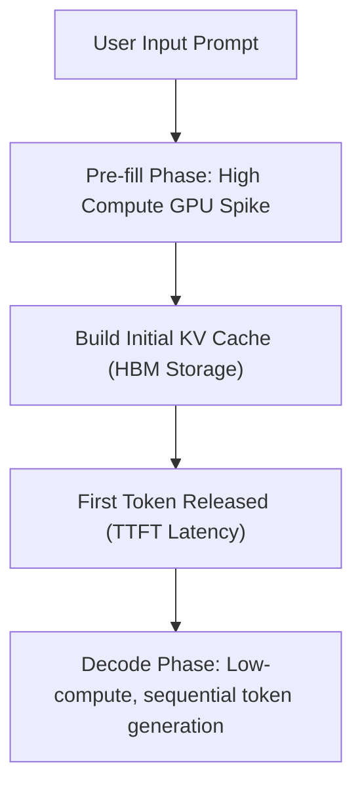

# The Time-to-First-Token (TTFT) Latency Spike

## Explanation
The **Time-to-First-Token (TTFT) Latency Spike** is a key user experience issue in LLM deployments, representing the delay between when a user submits a prompt and when the model starts outputting its first token.

### Mechanism
LLM generation consists of two primary phases:
1. **Pre-fill Phase (Compute-Bound)**: The model processes the entire input prompt at once to build the initial KV cache. For massive context windows (e.g., 32k+ tokens), this requires significant matrix math.
2. **Decode Phase (Memory-Bound)**: The model generates tokens autoregressively, one-by-one.

Because the pre-fill phase processes many tokens simultaneously, it saturates the GPU compute cores and blocks active decode phases in shared batches. This creates a scheduling queue bottleneck that increases TTFT for new requests.

### Significance
High TTFT makes real-time applications (such as conversational search or interactive chat assistants) feel slow and unresponsive, even if the subsequent generation speed (Inter-Token Latency) is fast.

### Advantages of Mitigations
* **Chunked Prefills**: Splitting large prompts into smaller chunks (e.g., 512 tokens) and interleaving them with active decoding steps reduces waiting times.
* **RadixAttention / Prompt Caching**: Caching the KV cache of common system prompts or document templates in memory bypasses the pre-fill step entirely for matching requests.

### Limitations
* **Implementation Complexity**: Requires advanced dynamic schedulers (like those in vLLM or TensorRT-LLM) to balance pre-fill chunk sizes and decoding steps without causing performance drops.

---

## Architecture Diagram

---

[Back to README](../README.md)
